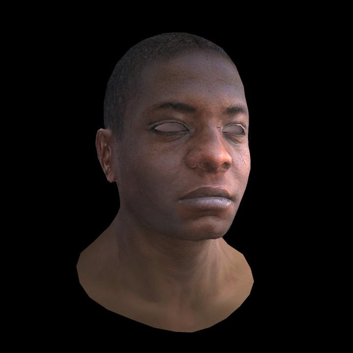

<h1 align="center">Just Rasterizer</h1>

软光栅化渲染器

## About

年轻人的第一台玩具级软光栅化渲染器，代码的设计和实现算法参考了许多的开源软渲染器和知乎等网站上的文章，感谢这些优秀且无私的作者。

## Reference

> 1. [Ray Tracing in One Weekend Series](https://raytracing.github.io/)
> 2. [smallpt - 99 行 C++ 代码实现全局光照](http://www.kevinbeason.com/smallpt/)
> 3. [smallpt魔改版 - vinjn 提供的合集](https://github.com/vinjn/learn-raytracing)
> 4. [smallpt改写为pbrt - infancy 的超长解析文章](https://infancy.github.io/smallpt2pbrt.html)
> 5. [Pursuit - ksgfk 的软光追渲染器](https://github.com/ksgfk/Pursuit)
> 6. [Nori - ksgfk 的作业解析](https://www.zhihu.com/column/c_1407025850030698496)
> 7. [TinyRenderer - 有些修改的中文教程](https://zhuanlan.zhihu.com/p/399056546)
> 8. [Filament - PBR 文档的中文翻译](https://jerkwin.github.io/filamentcn/Filament.md.html)
> 9. [GAME101 - liupeining 的作业7实现](https://github.com/liupeining/Games_101_homework/tree/main/a7)
> 10. [RenderHelp - 矢量模板类的设计值得学习](https://github.com/skywind3000/RenderHelp)
> 11. [恒星的离线渲染器](https://github.com/star-hengxing/cpu_offline_renderer)
> 12. [Mitsuba1/2 闫令琦推荐的科研渲染器](http://www.mitsuba-cornellBoxRenderer.org/)
> 13. [pbrt - 众所周知的圣经](https://www.pbr-book.org/3ed-2018/contents)

## TODO
- 抽象三角面
- 高斯模糊

## Feature
- [x] The Application Stage
  - [ ] Hierarchical View Frustum Culling 层次视锥裁剪
- [x] The Geometry Stage
  - [x] Vertex Shading
    - [x] Model Transform 模型变换
    - [x] View Transform 视图变换
    - [x] Projection Transform 透视投影变换
    - [x] Normal Transform 法线变换
  - [x] Clip Space
    - [ ] CVV Culling CVV剔除
    - [x] Backface Culling 背面剔除
    - [x] Perspective Division 透视除法
  - [x] NDC Space NDC空间
    - [x] Viewport Transform 视口变换
  - [x] ScreenSpace 屏幕空间
- [x] The Rasterizer Stage
  - [x] Triangle Setup
  - [x] Triangle Traversal
    - [x] Multi-sample Anti-Aliasing MSAA抗锯齿
    - [x] Barycentric Interpolation 重心坐标插值
  - [x] Pixel Shading
    - [x] Blinn-Phong Illumination Model 布林冯光照模型
  - [x] Merging Stage
    - [x] Z-Buffer 深度测试
  

## Dependence

- Tinny Render 中的 TGA 格式图片解析库
