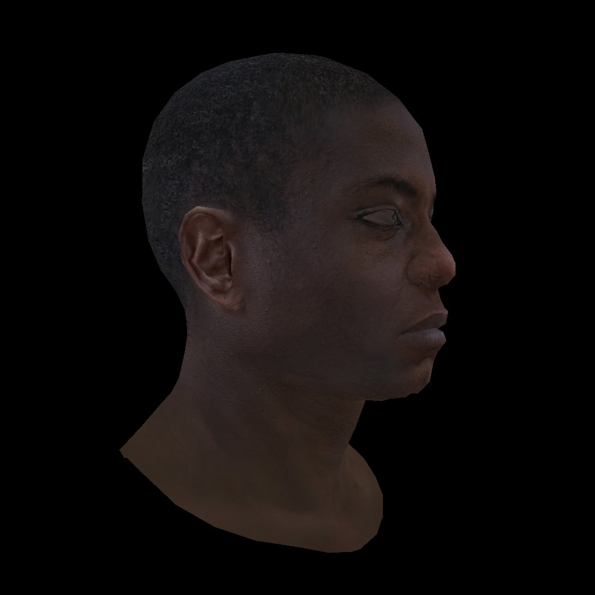

<h1 align="center">Just Renderer</h1>

软光栅化渲染器

## About

年轻人的第一台玩具级软光栅化渲染器，代码的设计和实现算法参考了许多的开源软渲染器和知乎等网站上的文章，感谢这些优秀且无私的作者。

## Reference

> 1. [Ray Tracing in One Weekend Series](https://raytracing.github.io/)
> 2. [smallpt - 99 行 C++ 代码实现全局光照](http://www.kevinbeason.com/smallpt/)
> 3. [smallpt魔改版 - vinjn 提供的合集](https://github.com/vinjn/learn-raytracing)
> 4. [smallpt改写为pbrt - infancy 的超长解析文章](https://infancy.github.io/smallpt2pbrt.html)
> 5. [Pursuit - ksgfk 的软光追渲染器](https://github.com/ksgfk/Pursuit)
> 6. [Nori - ksgfk 的作业解析](https://www.zhihu.com/column/c_1407025850030698496)
> 7. [TinyRenderer - 有些修改的中文教程](https://zhuanlan.zhihu.com/p/399056546)
> 8. [Filament - PBR 文档的中文翻译](https://jerkwin.github.io/filamentcn/Filament.md.html)
> 9. [GAME101 - liupeining 的作业7实现](https://github.com/liupeining/Games_101_homework/tree/main/a7)
> 10. [RenderHelp - 矢量模板类的设计值得学习](https://github.com/skywind3000/RenderHelp)
> 11. [恒星的离线渲染器](https://github.com/star-hengxing/cpu_offline_renderer)
> 12. [Mitsuba1/2 闫令琦推荐的科研渲染器](http://www.mitsuba-cornellBoxRenderer.org/)
> 13. [pbrt - 众所周知的圣经](https://www.pbr-book.org/3ed-2018/contents)

## TODO
- 纹理尺寸问题
- 应用阶段设置MVP数据
- 分离出三角形/面类型
- 分理出纹理类型

## Feature
- [ ] 模型相关
  - [x] Vertex 顶点
  - [ ] Triangle 三角形
  - [ ] Mesh 网格
  - [x] Model 模型
  - [ ] Texture 纹理
- [x] 渲染器相关
  - [x] Film 胶卷
  - [x] Camera 相机
  - [x] Scene 场景
  - [x] Renderer 渲染器
- [ ] 着色器相关
  - [x] BaseShader 着色器基类
  - [x] Default 默认着色器
  - [ ] Phong 冯模型
  - [ ] Blinn-Phong 布林冯模型
  - [ ] Mircofacet 微表面模型
- [x] 数学相关
  - [x] Global 全局定义
  - [x] Math 数据工具函数
  - [x] Vector 向量模板
  - [x] Matrix 矩阵模板
  - [x] Transform 变换工具函数

## Dependence

- Tinny Render 中的 TGA 格式图片解析库